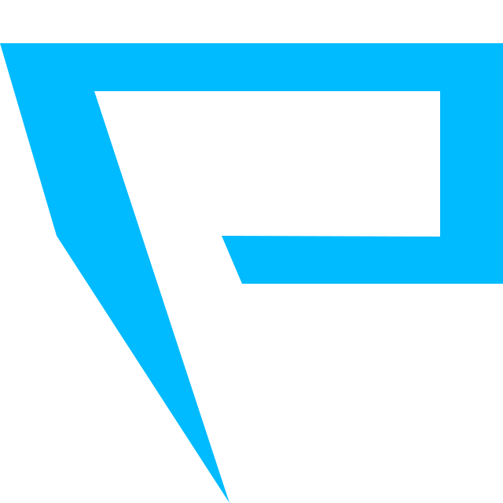

# [Capture The Flag](https://nilfalse.com/addons/ctf)

[](https://github.com/nilfalse/ctf/actions?query=workflow%3ACI)
[](https://coveralls.io/github/nilfalse/ctf)
[](https://depfu.com/github/nilfalse/ctf)

**Capture The Flag** is a privacy-focused browser extension for Firefox and Chromium which makes all sorts of meta information inferred from a website HTTP request accessible to the user.

[](https://nilfalse.com/addons/ctf)

It features a nice and clean UI which can:

- translate a server's IP address to country
- show which CDN and point-of-presense were used to deliver the website
- visualize how traffic has travelled before reaching your device

## 💿 Prerequisites

<dl>
    <dt>
        <a href="https://blog.maxmind.com/2019/12/18/significant-changes-to-accessing-and-using-geolite2-databases/">MaxMind GeoIP database</a>
    </dt>
    <dd>
        <small>
            Since by design this extension requires a local copy of an ip→country database, it is essential that during development you provide it with one.
            You'll have to obtain a license key in order to use MaxMind GeoIP database.
            Refer to their blog for more info on how to register for a free license key.
        </small>
    </dd>
    <dt>
        <a href="https://stedolan.github.io/jq/download/"><code>jq</code></a>
    </dt>
    <dd>
        <small>
            Some of the build steps in the codebase rely on <code>jq</code> being available in the system.
            Please refer to their website for the best way to get it installed on your operating system.
        </small>
    </dd>
    <dt>
        <a href="https://yarnpkg.com/">Yarn</a>
    </dt>
    <dd>
        <small>
            Yarn is used for fetching and building dependencies and to maintain the monorepo setup in this project.
        </small>
    </dd>
</dl>

## 📦 Building

Make sure your MaxMind license key is available to the build script:

```sh
export MAXMIND_LICENSE_KEY=REPLACE_THIS_WITH_YOUR_KEY
```

Then just run:

```sh
make
```

Or, if you don't intend to do it often, then just do a one-liner:

```sh
MAXMIND_LICENSE_KEY=REPLACE_THIS_WITH_YOUR_KEY make
```

The default Make target downloads and builds all relevant assets and puts them in the `bundle` package.

Subsequent builds can be significantly faster if you later use `build` target specifically:

```sh
make build
```

## 🛠️ Development

Ensure your MaxMind license key is available in the environment (see Building instructions above).

Download and install dependencies:

```sh
make primary-deps
```

Then, run the watch mode:

```sh
yarn start
```

<small>While it's building you may want to check out [how to load an unpacked extension](https://developer.chrome.com/extensions/faq#faq-dev-01) in Google Chrome.</small>

Once it's built you will be able to load the extension from a `./bundle` directory in the appropriate package.

## 🎁 Release

<small>TODO</small>

## 👨‍💻 Credits

Author: [Yaroslav Ilin](https://ilin.dk)

The distribution of this extension includes [Twemoji](https://github.com/twitter/twemoji) - an emoji library maintained by Twitter.

## 📄 LICENSE

```
  This Source Code Form is subject to the terms of the Mozilla Public
  License, v. 2.0. If a copy of the MPL was not distributed with this
  file, You can obtain one at http://mozilla.org/MPL/2.0/.
```
